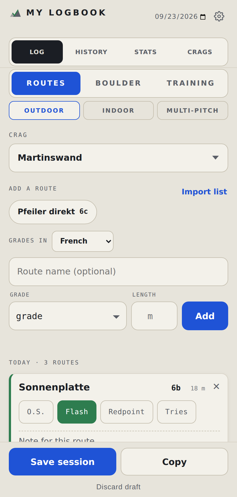
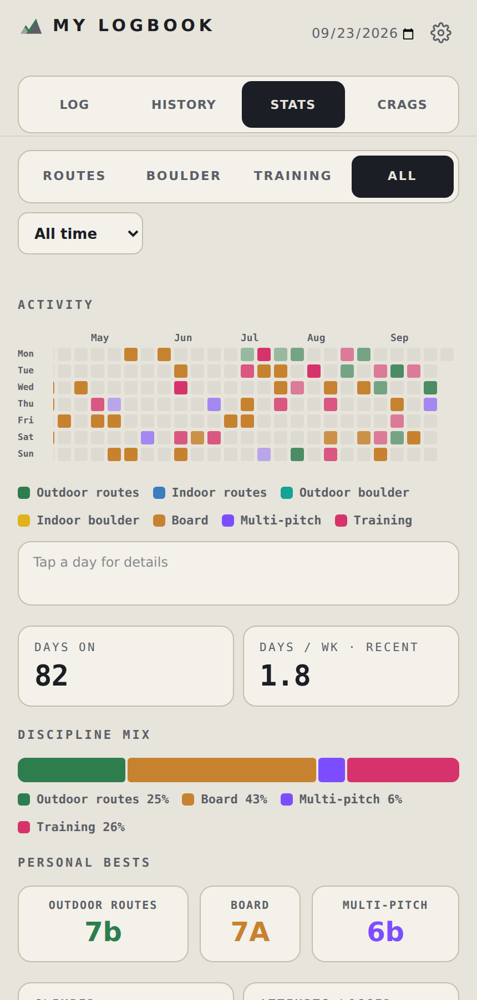
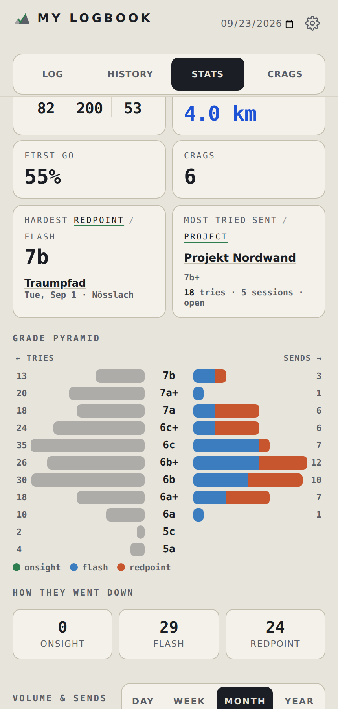
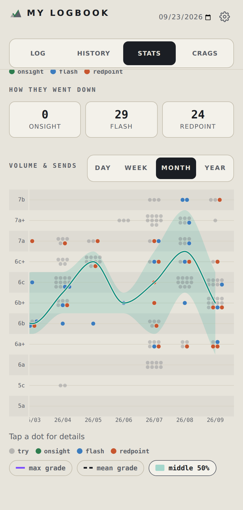
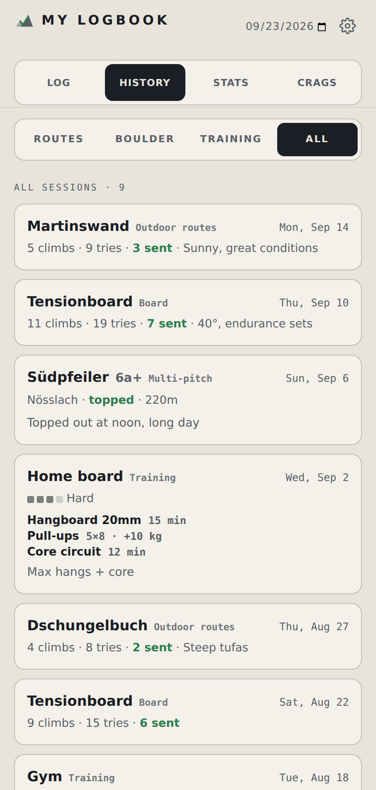

# My Logbook

A personal climbing logbook that runs as a web app on your phone. Log outdoor routes, gym
sessions, multipitch days and off-wall training; browse your history; and see what you've
been doing in a set of stats built for climbers.

It's a single HTML page backed by a small API and a SQLite database, all hosted on
Cloudflare's free tier. There's no server to maintain and no monthly bill.

<p>
  
  
  
  
  
</p>

> **This is a personal project.** It was built for my own use and is shared as-is.
> It works well for that, but it has no user accounts, no tests and no support. Read
> [Security](#security) before you deploy it.

---

## Features

### Log
- **Pick what you did in two taps:** *Routes*, *Boulder* or *Training*, then the kind:
  *Outdoor*, *Indoor* or *Multi-pitch* for routes, *Outdoor*, *Indoor* or *Board* for
  boulders. That makes seven categories. Switch off the ones you don't use in [Settings](#settings).
- **Outdoor routes:** pick or type a crag, add routes by name and grade, then mark each one
  O.S. / Flash / Redpoint / Tries, with a try counter and a note per route. A crag's saved
  routes appear as chips for one-tap re-adding, and you can paste a whole route list
  (`Name | grade`, one per line).
- **Indoor routes:** one tap per grade button. The grade list is editable, so French, V-grades or
  hold colours all work. You set the wall height once for the metres count.
- **Outdoor boulder:** like outdoor routes, for boulder problems: pick an area, add problems by name and
  Font or V grade, and mark each Flash / Send / Tries. Problems are saved per area with
  their own history.
- **Indoor boulder:** like indoor routes, one tap per Font, V or colour grade.
- **Board:** name the board (Tension, Kilter, MoonBoard…), then add problems by name and
  grade. Tension Board users can also sync their logbook automatically (see
  [below](#tension-board-sync)).
- **Multi-pitch:** build an ascent pitch by pitch (grade, lead or second, result, tries, length),
  or just log an overall grade and how many pitches you did. Logging fewer pitches than the
  route has records a bail (e.g. *bailed 4/5*). Routes are saved for reuse.
- **Training:** pick exercises from a searchable list, with your most-used ones as quick
  picks. There are three kinds: *sets* (sets × reps, optional added weight), *endurance*
  (distance, elevation, time) and *other* (optional time). Each session also gets an effort
  level from Mild to Max.
- **Drafts stay on the device** until you tap *Save session*. If you have no signal at the
  crag, the draft is kept and you save it later. *Copy* puts the session on the clipboard
  as plain text.

### History
- Every session, filterable by discipline. Tap a card to expand it and see the climbs.
- Edit or delete sessions and individual climbs.

### Stats
Everything can be filtered by category (the same two taps as in Log, plus *All*)
and by time (all time, a year, a month, or a custom range).

- **Activity calendar:** a GitHub-style heatmap coloured by discipline. Tap a day to see
  what you did.
- **Totals:** days, tries, sends, metres climbed, first-go rate, discipline mix and personal
  bests.
- **Highlights:** hardest redpoint / onsight / flash (with the routes), the route that took
  the most tries to send, and your most-tried open project.
- **Grade pyramid:** tries on the left, sends split by style on the right.
- **Volume & sends:** every try as a dot over time, with optional max grade, mean grade and
  middle-50% trend lines.
- **Discipline-specific cards:** multipitch (topped vs bailed, hardest led pitch, longest
  route), bouldering (flash rate, areas; benchmark problems for the board) and training
  (per-exercise totals and trends).

### Crags
- One list for all your places, whether sport crag, boulder area or both. Each shows what
  you have there (e.g. *12 routes · 5 boulders*), and a filter narrows it to Routes,
  Boulders or Multi-pitch.
- One search box that finds places, routes and boulder problems.
- A place's page shows its region, description, location and everything you've logged
  there, in separate Routes / Boulders / Multi-pitch sections. Tap one to see its full
  history.
- When logging, the area picker lists places where you've already done that kind of
  climbing first.
- Edit mode for the crag's name, region, description and coordinates (from your phone's
  location or picked on a map), and for its routes: rename, re-grade, set length and
  description, bulk-import, or delete.

### Settings
Open with the gear icon next to the date.

- **Appearance:** System, Light or Dark. *System* follows your phone's setting. This one is
  stored per device.
- **Categories:** switch off the disciplines you don't use (say, Board or Multi-pitch). They
  disappear from Log, History and Stats, and are left out of the "All" views. Nothing is
  deleted; switch one back on and its data returns.
- **Defaults:** the grade system for a crag you haven't logged before, and where the map
  picker starts (otherwise it opens on Innsbruck).

- **Export:** download your logbook as a CSV. Pick the categories and a period (all time,
  this year, the last 12 months or a custom range). You get one row per climb or exercise,
  and only the columns that fit: grades and results for climbing, pitches for multi-pitch,
  sets, time and effort for training. Get everything in one file, or one file per category
  (bundled as a ZIP). It opens cleanly in Excel, Numbers, Google Sheets, or pandas/R.
  Choose a comma or semicolon separator; Excel in German-speaking countries needs the
  semicolon.
- **Import:** load an export back in, for example on a fresh install or to move to a new
  database. Pick the CSV files or the ZIP; you'll see how many sessions are new and how many
  are already in your logbook before anything is written. Duplicates are skipped at the
  level of single climbs, so importing the same file twice changes nothing, and climbs that
  are missing from a session you already have are added to it. Crags come back with their
  region and map position, and synced board climbs keep their sync key, so a later Tension
  Board sync won't add them twice. Files that went through Excel (semicolons, `21.09.2026`
  dates, decimal commas) work too. The CSV holds your log, not everything: route notes and
  styles, crags you never logged a session at, and gym grade lists aren't part of it.

Categories and defaults are saved to your logbook, so they apply on every device you use.

### Grades
Log in the system a place uses: French, UIAA, YDS, Font, V-scale, or *Other* for custom
labels. Route grades are converted to French and boulder grades to Font for stats and
display, and the original grade is kept alongside it. Conversions use a standard approximate chart, so a converted grade is the
closest rung, not an exact match.

### Metres climbed
Each climb carries a length: the route's stored length, the length you entered, or 20 m by
default. Metres climbed = length × tries, so a route worked over four goes counts four times.
Boulders (outdoor, indoor and board) count as 0 m.

---

## How it works

```
my-logbook/
├─ public/
│  ├─ index.html          the whole front-end (HTML + CSS + JS, no framework, no build step)
│  ├─ manifest.webmanifest, icons
│  └─ import.html         legacy: one-off import from the original local-only version
├─ functions/
│  ├─ api/[[path]].js     the whole API, as one Cloudflare Pages Function
│  ├─ sync_tension/       optional: Tension Board sync (see below)
│  └─ import_routes/      optional: bulk import of old sessions from a CSV (see below)
├─ migrations/            database changes, for upgrading an existing install
├─ schema.sql             full database schema, for a fresh install
├─ wrangler.toml          Pages + D1 config
└─ package.json           convenience scripts
```

- **Front-end:** one static page. Drafts and a cache of your crags live in `localStorage`.
- **API:** `functions/api/[[path]].js` handles every `/api/*` request. The database is
  available to it as `env.DB`.
- **Database:** [Cloudflare D1](https://developers.cloudflare.com/d1/) (SQLite). Routes are
  real rows, not retyped strings, so every attempt on a route across every session links
  back to it. That's what makes per-route history, projects and highlights possible.

---

## Deploy

You'll need Node.js, a Cloudflare account and a GitHub account. It takes about 15 minutes.
The commands work the same on Windows (PowerShell), macOS and Linux.

### 1. Put the code in a GitHub repo
Fork this repo, or copy the folder into a new repo of your own.

### 2. Create the database
```bash
npx wrangler login
npx wrangler d1 create mylogbook
```
Copy the printed `database_id` into `wrangler.toml`, replacing the placeholder. Then load
the schema:
```bash
npx wrangler d1 execute mylogbook --file=./schema.sql --remote
```
`schema.sql` is complete, so a fresh install doesn't need the files in `migrations/`.

### 3. Create the Pages project
In the Cloudflare dashboard: **Workers & Pages → Create → Pages → Connect to Git**, and pick
your repo.

- Build command: *(leave empty)*
- Build output directory: `public`

Deploy. You'll get a URL like `https://<your-project>.pages.dev`.

### 4. Bind the database
**Your Pages project → Settings → Bindings → Add → D1 database.** Variable name `DB`,
database `mylogbook`. Save, then redeploy (**Deployments → Retry deployment**, or push a commit).

### 5. Lock it down
Do this before you log anything. See [Security](#security).

### 6. Install it on your phone
Open the URL and use your browser's **Add to Home Screen**. It then opens full-screen like
an app.

---

## Security

**The app has no login of its own.** Anyone who can reach the URL can read and change your
whole logbook, and the API allows requests from any origin. You must put something in front
of it. There are two options:

- **Cloudflare Access (recommended).** In Zero Trust → Access → Applications, add your
  `<your-project>.pages.dev` domain as a self-hosted app and allow only your email address.
  You'll sign in once per device, and no code changes are needed.
- **Shared password (quicker, weaker).** Set an `APP_SECRET` variable on the Pages project
  (**Settings → Variables and Secrets**). The API then requires it, and the app asks for it
  once per device and remembers it.

The optional import scripts use a separate token (`IMPORT_TOKEN`), described below.

---

## Updating an existing install

Code changes deploy when you push to GitHub. Database changes are a separate step you run
once. If you installed from an older version, apply every migration newer than your install,
in order:

| Migration | Adds |
|---|---|
| `0001_grades_and_edit.sql` | grade systems + French display value |
| `0002_route_length.sql` | route length |
| `0003_length_and_coords.sql` | per-climb length, crag coordinates |
| `0004_import_key.sql` | de-duplication key for imported board ascents |
| `0005_multipitch.sql` | multipitch routes and pitch logs |
| `0006_benchmark.sql` | board benchmark flag |
| `0007_training.sql` | training effort level |
| `0008_exercises.sql` | training exercises and entries |

```bash
npx wrangler d1 execute mylogbook --file=./migrations/0008_exercises.sql --remote
```

All migrations only add things. If one ever goes wrong, D1 Time Travel can restore the
database to any point in the last 30 days (`npx wrangler d1 time-travel info mylogbook`).

---

## Optional importers

Both importers post to `/api/import/*`, which is protected by its own bearer token rather
than by the browser login.

**Shared setup:**
1. Generate a token (`openssl rand -hex 32`) and set it on the Pages project, then redeploy:
   ```bash
   npx wrangler pages secret put IMPORT_TOKEN --project-name <your-project>
   ```
2. If the site is behind Cloudflare Access, create a **service token** (Zero Trust → Access →
   Service credentials) and add a policy to your app with **Action = Service Auth** that
   includes it. A normal *Allow* policy will not accept a service token.
3. Create a file called `.env` in the folder you run the script from
   (`functions/sync_tension/` or `functions/import_routes/`). Both paths are already in
   `.gitignore`. Never commit this file.
   ```bash
   export CRAGLOG_URL="https://<your-project>.pages.dev"
   export CRAGLOG_IMPORT_TOKEN="<same value as IMPORT_TOKEN>"
   # only if the site is behind Cloudflare Access:
   export CF_ACCESS_CLIENT_ID="<service token Client ID, ends in .access>"
   export CF_ACCESS_CLIENT_SECRET="<service token Client Secret>"
   ```
   Load it with `source .env` before running a script. Keep the `export` on every line,
   or the scripts can't see the values.

### Tension Board sync
`functions/sync_tension/` uses [BoardLib](https://github.com/lemeryfertitta/BoardLib) to
export your Tension Board logbook, then pushes it into the **Board** discipline. Your Tension
password never leaves your machine; only the exported ascents are sent.

You need Python 3 and a bash shell (macOS, Linux, or WSL on Windows). The script installs
BoardLib itself on the first run, into a private `.venv` folder next to it. On Debian or
Ubuntu you may first need `sudo apt install python3-venv`.

```bash
cd functions/sync_tension
source .env
./sync_tension.sh <your-tension-username>
```

The script asks for your Tension password each time. To skip the prompt, add
`export TENSION_PASSWORD="…"` to the same `.env`.

Re-running is safe: each ascent is keyed on climb + mirror + date, so existing ascents are
updated rather than duplicated. Results are mapped as follows: not sent → attempt; sent on
the very first try ever → flash; anything else sent → redpoint. Boards have no onsight.

The sync only ever adds to its own *Tensionboard* sessions, never to board sessions you
logged by hand. If you sync, don't also log your Tension sessions by hand, or they'll be
counted twice.

<details>
<summary>Troubleshooting</summary>

| Symptom | Cause / fix |
|---|---|
| `URL can't contain control characters … '\r'` | `.env` has Windows line endings. Run `sed -i 's/\r$//' .env`, then `source .env` again. |
| `HTTP 403: error code 1010` | Cloudflare's Browser Integrity Check blocked the request. If it persists, add a WAF **Skip** rule for `/api/import/*`. |
| You get the Cloudflare Access sign-in page back | Access didn't accept the service token. Check the `CF_ACCESS_*` values and that the app has a **Service Auth** policy that includes the token. |
| `503 {"error":"import endpoint not configured"}` | `IMPORT_TOKEN` isn't set on the running deployment. Set it on **Production** and redeploy. |
| `401 {"error":"unauthorized"}` | `CRAGLOG_IMPORT_TOKEN` doesn't match the Worker's `IMPORT_TOKEN`. |

To check the connection without importing anything:
```bash
curl -s -X POST "$CRAGLOG_URL/api/import/board" \
  -H "authorization: Bearer $CRAGLOG_IMPORT_TOKEN" \
  -H "CF-Access-Client-Id: $CF_ACCESS_CLIENT_ID" \
  -H "CF-Access-Client-Secret: $CF_ACCESS_CLIENT_SECRET" \
  -H "content-type: application/json" -d '{"ascents":[]}'
```
`{"error":"no ascents provided"}` means everything is connected. BoardLib's `FutureWarning`
lines are harmless.
</details>

### Old sessions from a CSV
`functions/import_routes/import_routedatabase.py` bulk-imports historical outdoor sessions.
It groups rows by date and crag, creates crags (with region and coordinates) and routes, and
skips sessions that already exist, so re-running is safe. Use `--dry-run` to preview first.

It was written for one particular spreadsheet export, so expect to adapt the column names
and the result mapping to your own file. See `functions/import_routes/README.md` for details.

---

## Local development

```bash
npm install
npx wrangler d1 execute mylogbook --file=./schema.sql --local
npx wrangler pages dev public
```
This serves the site and runs the API against a local copy of the database.

---

## API reference

All endpoints are under `/api`.

| Method | Path | Purpose |
|---|---|---|
| GET | `/bootstrap` | crags + routes, gym grades, exercises, app settings (hydrates the app) |
| GET / POST | `/crags` | list crags / create one `{name, region?, notes?, lat?, lng?}` |
| GET / PATCH / DELETE | `/crags/:id` | a crag with its routes / edit / delete |
| GET | `/crags/:id/routes` | routes at a crag |
| POST | `/crags/:id/import` | bulk-add routes `{grade_system, routes:[…]}` |
| POST | `/routes` | create or update a route |
| GET / PATCH / DELETE | `/routes/:id` | a route with its full history / edit / delete |
| GET / POST | `/sessions` | list sessions / save one `{date, mode, place, note, ticks:[…]}` |
| GET / PATCH / DELETE | `/sessions/:id` | a session with its climbs / edit / delete |
| POST | `/sessions/:id/ticks` | add a climb to a session |
| PATCH / DELETE | `/ticks/:id` | edit / remove a climb |
| POST | `/multi/ascents` | log a multipitch ascent |
| PATCH | `/multi/ascents/:id` | edit a multipitch ascent |
| POST | `/cross` | log a training session `{date, intensity, note, entries:[…]}` |
| PUT | `/cross/:id` | replace a training session |
| GET / POST | `/exercises` | list / create exercise definitions |
| DELETE | `/exercises/:id` | remove an exercise from the picker (logged training is kept) |
| GET | `/stats?scope=&from=&to=&hide=` | everything the Stats tab shows; `hide` is a comma list of categories to leave out |
| GET | `/export?modes=&from=&to=&sep=&files=` | tidy CSV of your logbook (`modes`: comma list of categories; `sep`: `comma` or `semicolon`; `files=per`: ZIP with one CSV per category) |
| POST | `/restore` | write back sessions parsed from an export `{items:[…]}`; the app checks for duplicates and sends small batches |
| GET / PUT | `/settings/:key` | small key–value settings (gym grades, `app_settings` from the Settings page) |
| POST | `/import/board` | bulk-import board ascents (bearer `IMPORT_TOKEN`) |
| POST | `/import/sessions` | bulk-import outdoor sessions (bearer `IMPORT_TOKEN`) |

---

## License

MIT, see [LICENSE](LICENSE). Provided as-is, without warranty.